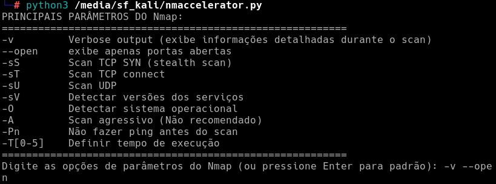
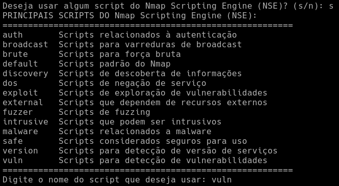
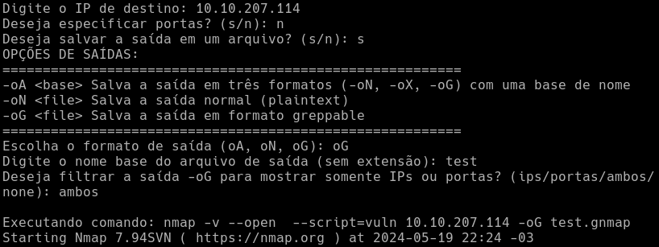
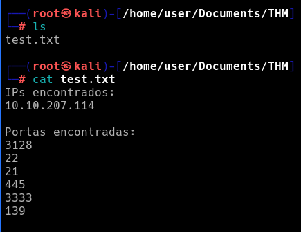

# Nmap Accelerator

O Nmap Accelerator é um script Python desenvolvido por mim, um estudante de Segurança da informação, para facilitar o uso do Nmap. Este script permite que os usuários configurem e executem varreduras de rede de maneira rápida e eficiente, oferecendo opções para definir parâmetros de varredura, especificar portas, utilizar scripts do Nmap Scripting Engine (NSE) e salvar resultados em diferentes formatos de saída.

## Como Funciona
O Nmap Accelerator é executado a partir da linha de comando. Ele solicita ao usuário as opções desejadas de parâmetros de varredura, scripts do NSE, endereço IP de destino, portas a serem escaneadas e opções de saída. Com base nessas entradas, o script constrói e executa o comando Nmap correspondente usando a biblioteca subprocess do Python.

Após a conclusão da varredura, o script pode filtrar a saída do Nmap, se desejar. Por exemplo, é possível extrair apenas os IPs ou as portas abertas encontradas durante a varredura e salvá-los em arquivos separados.

## Principais Recursos
Facilidade de uso: Interface intuitiva para personalizar as varreduras do Nmap. Com a exibição das opções, não é preciso ficar presquisando pelos (principais) parametros ou scripts que não se lembrar.

Opções de saída flexíveis: Salve a saída da varredura em diferentes formatos.

Filtragem de resultados: Extraia apenas as informações relevantes dos resultados da varredura para análise posterior.

## Funcionalidades

O script oferece as seguintes funcionalidades:

- **Seleção de Parâmetros do Nmap:** Os usuários podem escolher os parâmetros do Nmap, incluindo diferentes tipos de varredura, detecção de versões de serviços e sistemas operacionais, e configurações de tempo de execução.

- **Utilização de Scripts do NSE:** Os usuários têm a opção de utilizar os scripts disponíveis no Nmap Scripting Engine (NSE), que oferecem funcionalidades adicionais para detecção de vulnerabilidades, exploração de serviços e muito mais.

- **Especificação de Portas:** Os usuários podem especificar portas individuais ou intervalos de portas para varredura, permitindo uma personalização completa do escopo da varredura.

- **Opções de Saída Flexíveis:** O script oferece opções para salvar os resultados da varredura em diferentes formatos, incluindo texto simples, XML e formato greppable, com a capacidade de filtrar e extrair informações específicas, como IPs e portas abertas.

## Como Usar

Para usar o Nmap Accelerator, siga estas etapas:

1. **Clone o Repositório:** Baixe ou clone o repositório para o seu ambiente local.

2. **Execute o Script:** Execute o script `nmaccelerator.py` em um terminal Python compatível.

3. **Siga as Instruções:** Siga as instruções fornecidas pelo script para selecionar parâmetros de varredura, especificar o IP de destino, definir portas de interesse e escolher opções de saída.

4. **Analise os Resultados:** Após a conclusão da varredura, analise os resultados salvos nos arquivos de saída especificados.

## Exemplo de uso

Ao executar o script Python, é exibido exemplos de parâmetros comuns, útil para não precisar pesquisar por parâmetros, importante ressaltar que essas são apenas algumas opções, e o script não se restringe a elas somente.

Logo em seguida, temos a opção de inserir scripts, caso o usuário queira, basta usar "s", e aparecerá uma lista com alguns exemplos de script para usar, para, novamente, não precisar ir pesquisar, e então, basta digitar o nome do script.

Então, deve-se inserir o ip alvo (que nesse caso, é de uma Room do TryhackMe, dstalhe que eu já estou conectado a VPN para conseguir acessar as Rooms do TryhackMe), então a opção de inserir as portas, podendo usar apenas uma, várias separadas por virgula, ou um intervalo de portas, nesse caso escolhi não filtrar por portas especificas, por isso só usei "n".
Após isso, temos as opções de saídas, ou seja, um arquivo com o resultado do scan, nesse caso escolhi salvar um arquivo em formato greppable, por isso usei "s" e depois "oG", depois deve-se inserir o nome do arquivo, sem extensões, nesse caso escolhi "test" e depois deve-se escolher se o arquivo terá somente ip, porta, ambos ou se não usará filtro, nesse caso escolhi "ambos"
Então o comando será executado, note que o nome do arquivo aparece como "test.gnmap", mas ao fim do programa haverá somente o resultado filtrado com a extensão ".txt".

OBS: Esse exemplo se aplica somente caso o usuário escolha oG, caso escolha uma outra opção, será diferente e mais simples.

Por fim, após o script ser executado pode-se visualizar o arquivo e seus conteudos.

Recapitulando, esse exemplo é apenas uma possibilidade, pode-se especificar as portas, usar ou não scripts, salvar as saídas de outras formas, ou apenas visualizar sem opção de saída.

## AVISO LEGAL/DISCLAIMER E AMBIENTE DE TESTES

Este script foi desenvolvido por um estudante para praticar e para fins educacionais e de testes. Foi testado em um ambiente controlado do TryHackMe para garantir sua funcionalidade e compatibilidade com o Nmap. Se você encontrar problemas ou tiver dúvidas sobre o uso do script, sinta-se à vontade para relatar problemas ou entrar em contato para obter suporte adicional.
Não é destinado a ser utilizado para fins maliciosos ou ilegais. O uso deste script em ambientes de produção ou em redes que você não tem permissão para escanear pode violar leis ou políticas de segurança. Sempre obtenha permissão adequada antes de realizar varreduras de rede em qualquer ambiente.
